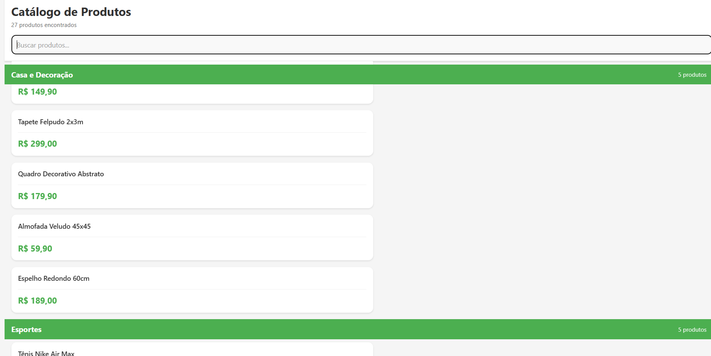
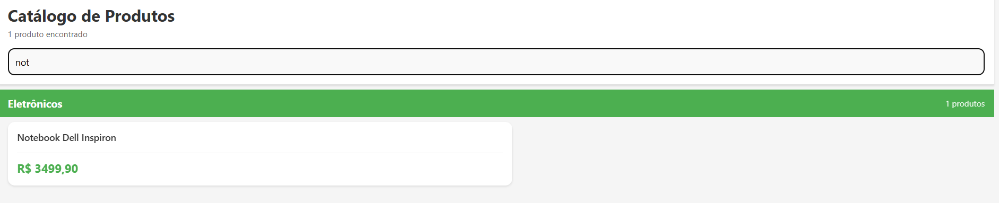
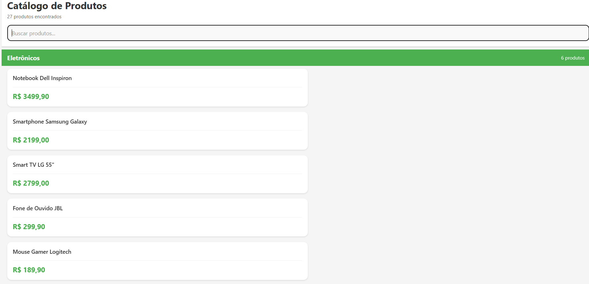

# DSM2 - Desenvolvimento de Software para Dispositivos Móveis II (2025-2)

## 👤 Aluno
**Nome:** Felipe Batarra

---

### 📱 Aula 07: Catálogo Interativo de Produtos

O foco desta atividade foi a **otimização de listas** e o **layout adaptável**, conforme o desafio proposto: *"Catálogo Interativo de Produtos"*.

| Conceito da Aula | Funcionalidade Implementada | Status |
| :--- | :--- | :--- |
| **Renderização Otimizada** | Uso de `SectionList` para agrupar produtos por categoria | ✅ Completo |
| **Filtragem de Dados** | Campo `TextInput` no topo para buscar produtos por nome | ✅ Completo |
| **Layout Responsivo** | Estilos adaptados para diferentes tamanhos de tela (demonstrado nas capturas) | ✅ Completo |
| **Desempenho** | Utilização de memoização e otimização de renderização (`keyExtractor`) | ✅ Aplicado |

---

## 🖼️ Capturas de Tela do Catálogo de Produtos (Aula 07)

As imagens abaixo demonstram o funcionamento da listagem, o agrupamento por categoria (`SectionList`) e a funcionalidade de busca e filtro.

